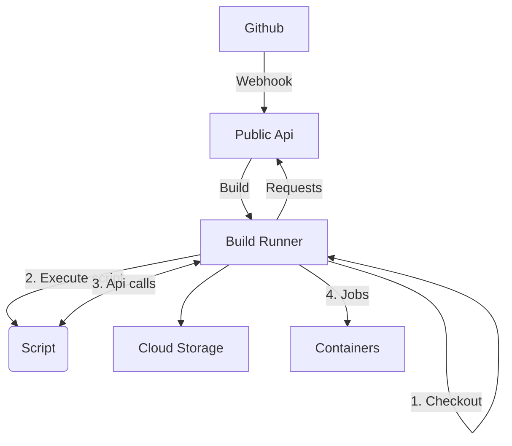

# Script API

The Yaml-based tools have no other option than to provide all information
from the start to the script.  Usually as environment variables, although
some offer a script-only alternative.  In the case of _MonkeyCI_, we have
the possibility to expand on this.  Since the build script is actually a
small application, we can provide ways to retrieve information as needed.
This can be done through the script API.  When the build script is started,
it gets passed in a URI and JWT that can be used to invoke requests on the
_MonkeyCI_ API.  This is of course of limited scope, determined by the
token.  This also means we'll need to implement [security](security.md).

## Overview

The build flow looks like this:

After a new build has been triggered, in this case by a Github webhook,
the build runner starts the flow:

  1. The relevant code is checked out from the repository.
  2. A child process is started that runs `clojure -X` that loads and runs the build script.
  3. The build script communicates back to the build runner with progress events and requests.
  4. When so requested by the script, jobs are started in additional containers.

Cloud storage is used to keep track of any persistent data, like logs, artifacts,
etc...  When needed, the build runner sends requests back to the public API,
for example to fetch build parameters.

## Operations

The operations that can be executed through the API can be one of these:

 - Retrieve sensitive information (e.g. credentials to be used elsewhere).
 - Store or retrieve script results (like test coverage or artifacts).
 - Fetch project or customer data.
 - Build information, like commit id, branch, etc...

Some of this information can be passed on at script startup time, but others
will have to be retrieved by sending a HTTP request to the API.

## Endpoint

The most obvious endpoint could be the main _MonkeyCI_ API.  But some things
could also be executed by the script runner itself.  We'll have to see how
this turns out, but initially we could send all requests to the central API.

Should the need arise to communicate to the script runner, we could use a
domain socket instead of a HTTP endpoint.

## Implementation

The script API is made available through functions, exposed in the _MonkeyCI_
script library.  The namespace will probably be `monkey.ci.build.api`.  The
underlying functionality could be handled by [Martian](https://github.com/oliyh/martian).
The server-side API would offer an [OpenAPI spec](https://spec.openapis.org/oas/latest.html),
that is then read by the client.  In this way, the client would know which
services are available to invoke.

## Infrastructure

Infra-wise the API will probably be exposed either though a UDS (which could
in turn redirect some calls to HTTP), or the [OCI API gateway](https://docs.oracle.com/en-us/iaas/Content/APIGateway/home.htm).
This allows us to decouple the backend from the exposed endpoints.  It would also
avoid overloading the general API.  The client would have no need for security
credentials, since these are handled by the controlling process.

## Security

The build script can only have limited permissions on the API.  Because the script
can only access the API through the build runner controlling process, security
can be implemented on that level.  The build runner itself receives a token that
it can use to fetch more information from the public API or to access the storage
directly.  Depending on the implementation, storage is either some form of cloud
storage, or just files on local disk.