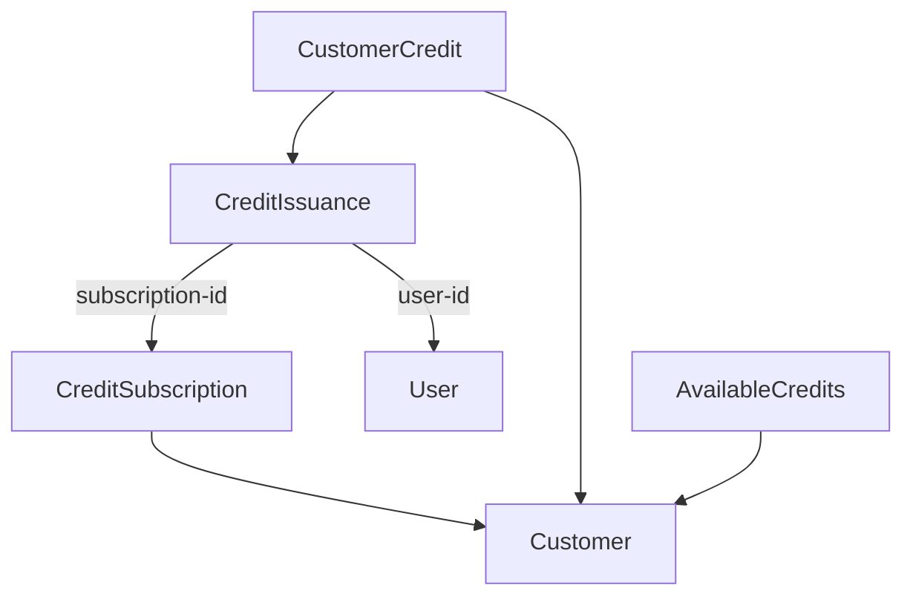

# Credit Issuance

Users can only run builds if the customer associated with the repository has
available credits.  Since this is a core feature of the application, we need
to make it robust and as future-proof as possible.

## Entities

Several entities are involved in the credit issuance process.

 - `Customer`: the one credits are issued to.
 - `CustomerCredit`: keeps track of an amount of issued credits.
 - `CreditIssuance`: denotes a single credit issuance.
 - `CreditSubscription`: indicates that a customer should be issued credits on a regular basis (i.e. monthly).
 - `User`: involved when credits are issued on an ad-hoc basis.

The entities are related to each other like this:

### Issuing

A `CreditIssuance` has a `type` property, that indicates whether the issuance is
the result of a subscription, or of an arbitrary action by a user (ad-hoc).  In case
of a subscription, the `subscription-id` points to the `CreditSubscription`.

A `CreditSubscription` has a `valid-from` and `valid-until` timestamp, and also an
`amount`.  Currently the issuance period is always monthly, in which case we will
check if an issuance has occurred in the past month, and if not, new credits with
the specified amount will be issued.  A cronjob is responsible for doing this
issuance, by invoking an endpoint on the `/admin` route tree.  In the future we
may consider doing the issuing directly.

It's also possible a user with the right privileges (e.g. a salesperson or admin)
wants to issue credits to a customer just once, in which case the `user-id`
property on the issuance will point to the user in question.  A `reason` can also
be given in this case.

The `CustomerCredit` record that is the result of the issuance will the point to
the `CreditIssuance`.  The reason these two entities are not merged into a single
entity is because the issuance information is irrelevant most of the time for
credit calculation.

### Credit Calculation

Whenever a build is triggered, we should check whether the user has sufficient
credits available.  Since it's not possible to predict how many credits will be
consumed by a build, we will just check if the credit balance is positive.  We
may also perform this check at the start of each job.  This would avoid a customer
"going below zero" too much, at the cost of some performance loss.  Initially we
will only do the check at the start of the build.  If no credits are available,
the build fails.

After the build completes, a new `CreditConsumption` record is created, that
points to the build and the `CustomerCredit` the credits are subtracted from.
If insufficient credits are available for the build, a new record is created
that points to another `CreditConsumption`.  So multiple consumption records
could exist for a single build.

In order to calculate how many credits are available at any one time, we need to
sum up all `CustomerCredit` amounts and subtract all `CreditConsumption` amounts.

## Optimization

In time, the calculation of available credits will of course become slow, as the
number of consumption and credit records increases.  In order to avoid performance
issues here, we will need to set up some sort of caching and/or checkpointing
system.  A [Redis](https://redis.io/) server could be set up to keep track of
this information, or we could set up a special table in the database that just
holds the `AvailableCredit` for a customer.  The latter is easier to set up and
maintain, but we would have to use record locks to avoid multiple updates
overwriting each other, or we could use a message queue for this.
