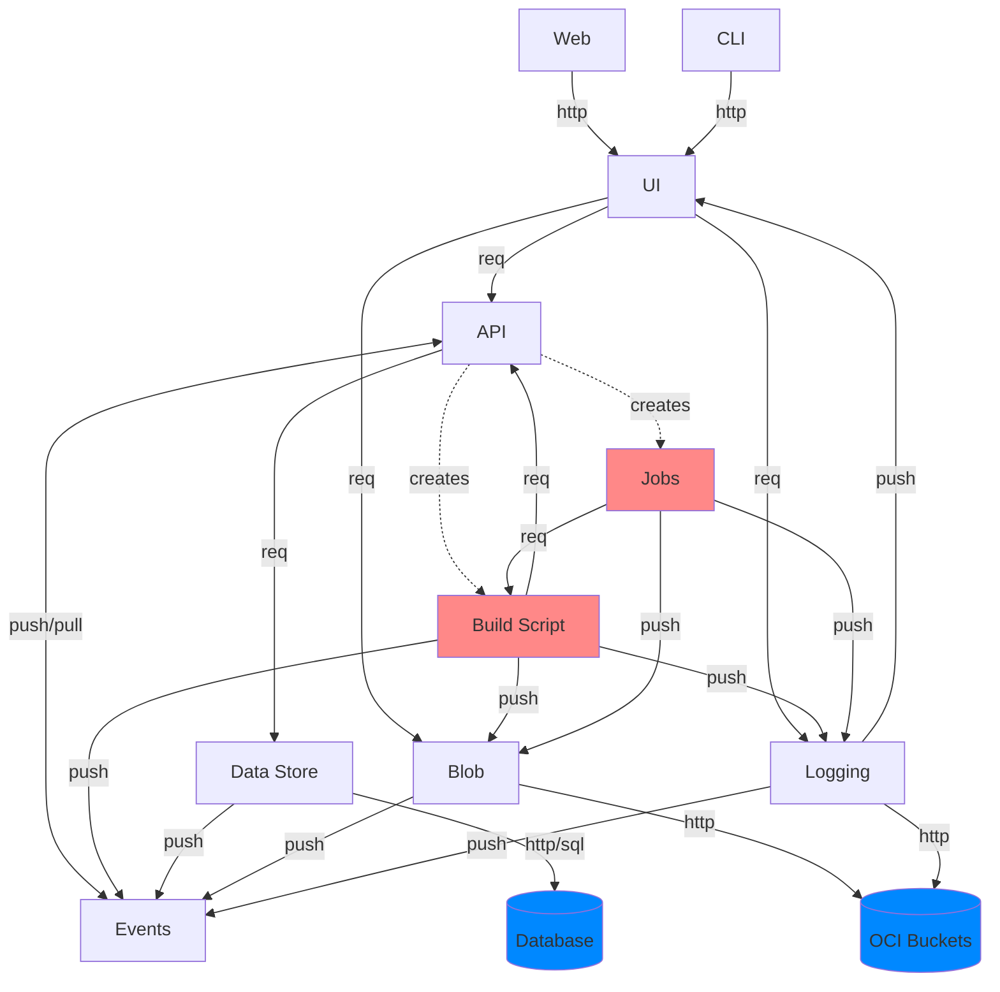

# Events and Modules

We're aiming for a modular design.  This to allow us to scale the application as we see fit.
Also, it's better from a testing point of view: if we make sure the contracts for the module
communication are strictly defined, then we can test modules without having to set up the
entire application around it.

## Communication

Initially the intention was to use events for inter-module communication.  But it turns out
this is not always desirable.  Sometimes you just want to send a plain request and get a
reply.  This does make it harder to set up a way for the modules to communicate with each
other that is more or less generic.  We want to avoid having to take into account the kind
of communication when modules talk to eachother.  Possible ways of communicating are: http
requests, websockets, http server-sent-events, Unix domain sockets, JMS events, OCI streaming,
internal async channels, etc...  Some of these can be categorized under "events", others
under "requests".  Ideally, we want to abstract away the underlying method of communication,
and only have to know whether we want to send a request to which we expect a reply, or just
post an event where we don't care who listens in.

Initially the intention was to write our own abstraction using [core.async](https://clojure.github.io/core.async/)
channels.  But after working with them for a while, I'm no longer convinced this is the way
to go.  They are just too cumbersome and difficult to test.  [Manifold Streams](https://github.com/clj-commons/manifold#streams)
are similar.  The advantage is that they seem to allow more control, and they function more
as a layer on top of other async platforms.  But it's still only meant for async processing.
In _MonkeyCI_ we have various modules that communicate with each other in different ways
depending on the situation.  Sometimes this is purely in-process, or it could be over a UDS
for parent-child processes.  Or just over HTTP, for instance when the UI talks to the backend.

## HTTP

Http is still the most portable solution for the outside world.  But due to the purely
request/reply nature, it is somewhat harder to use it for events, especially when you're on
the receiving end.  I tried using SSE, but it turns out support in the existing tools is
not that good.  Websockets are a possible alternative, but they are more complex.

## ZeroMQ

[ZeroMQ](https://zeromq.org/) is a possible alternative.  It is set up as a universal messaging
library, with different "types" of sockets.  These "sockets" are also an abstraction over
various kinds of communication.  These can be TCP sockets, or in-process channels.  The
advantage is that ZeroMQ already provides an abstraction over the lower layers, and it also
includes a bunch of functionality to improve stability (like auto-reconnection).  The
different types can be used for different scenarios, like pub/sub, streaming, or request/reply.
This makes it a good candidate to use in _MonkeyCI_ to set up inter-modular communication.

A drawback is that it uses a custom protocol, so we can't use many of the existing tools for
load balancing, security, etc... that are available for HTTP.  So it's important that we
only use it for internal communication, and not when talking to the outside world.

## Modules

The various modules in the application are these:

 - API, which provides a HTTP interface for 3rd parties and the UI.
 - UI, which is either the CLI or the web application.
 - Event hub (pub/sub)
 - Blob storage, that is used to store and serve large files (backed by an OCI bucket)
 - Logging, similar to blob storage, but it also provides a way to live-stream logs
 - Data storage, currently backed by an OCI bucket, but most likely later by an SQL db.
 - Build scripts, short-lived and created by the API.
 - Jobs, also short lived and created by the build scripts.

In the chart, the blue items are external apps.  Red are short-lived entities.  You see it
becomes complicated fairly quickly.  The idea is to write the code so that it is possible
to put most of these things into one process, but also allow modules to be split off (and
scaled) into separate processes as needed.