# Running On Oracle Cloud

To run the application serverless on [Oracle Cloud](https://cloud.oracle.com),
we would need the following services:

 - [API gateway](https://docs.oracle.com/en-us/iaas/Content/APIGateway/home.htm), to receive the incoming webhooks.
 - [Cloud functions](https://docs.oracle.com/en-us/iaas/Content/Functions/home.htm), to handle the incoming webhook call and bootstrap the build.
 - [Container instances](https://docs.oracle.com/en-us/iaas/Content/container-instances/home.htm), to run the build job.

## Running the Build

The cloud function would have to return quickly in order to avoid a timeout on
the webhook caller's end.  For this, we could either run it in a new function,
or start a container instance.  It would depend on the price which one to use.

The build pipeline would then run each step in a new container instance.  The
issue to solve here is storage.  OCI container instances only support `EmptyDir`
volumes, so we can't mount the source repository in it.  If possible, we should
first fill it using an `initContainer`, but the current implementation does
not seem to support that, although it does support multiple containers.  A possible
workaround could be to run a script that waits for the repository to have filled
(along with any required artifacts from previous steps) using some sort of trigger
(e.g. a lock file).  This does mean that we would spend unnecessary ocpu cycles,
but we would have to investigate whether the billing is counted towards the entire
container instance, or each container separately.  I assume the former, if I read
the [pricing page](https://www.oracle.com/cloud/cloud-native/container-instances/pricing/?source=:ow:o:h:nav:092121OCISiteFooter) correctly.

Alternatively it's also possible to mount configfiles as a volume.  We could
prepare the source information as a tarball and then inject it as a config file.
Docs don't specify a max size, and it's not sure this will be cheaper though.  This
would have to be investigated.  A probably issue here is that the http request
to create the instance would become too large.

We would also use the [events API](https://docs.oracle.com/en-us/iaas/Content/Events/Concepts/eventsoverview.htm#Overview_of_Events) to react to the completion of a job.  In order to capture any
artifacts, we would also require some sort of "finish container", that runs when
the main build step is finished.  This would possibly also require a similar
trigger mechanism.  Currently, OCI does not fire events for container instances,
so this cannot be used (yet).

## Events

We could use [OCI queue](https://docs.oracle.com/en-us/iaas/Content/queue/home.htm)
to dispatch events between the various parts of the application.  Note that this
is only useful if you have a process that continuously polls the queue, or
periodically pulls in any queued up messages.  Also, queued messages can only be
handle by a single consumer, so multicasting events is not possible with this.
We could instead use [streaming](https://docs.oracle.com/en-us/iaas/Content/Streaming/home.htm),
which would allow multicasting and also to execute functions on incoming events.
[Pricing](https://www.oracle.com/cloud/price-list/?source=:ow:o:h:nav:092121OCISiteFooter#streaming)
for this is dependent on the amount of stored events and the number of operations.

Since running functions for fairly trivial operations is most likely overkill, it
would be more logical to have only a few processes (initially just one) that
handle events, for example for billing and metering purposes.

## Sidecar

After some investigation it has come up that it is not possible (or in any case
very difficult) for a container instance to start another container.  This is
because of limitations imposed by the container instance environment.  This means
that we won't be able to run an instance that both runs the build script and runs
each container job step in one go.  We either would have to step away from using
container instances to run the script, and instead resort to some kind of build
agent pool, or we would have to let the instances run container jobs in another
way, like sending a request to the _MonkeyCI_ API instead.

The sequence looks like this:

```mermaid
sequenceDiagram
    participant API
    participant OCI
    participant B as Build script
    participant J as Job
    participant S as Sidecar

    API-)OCI: Create build instance
    OCI->>+B: Start build
    API--)OCI: Poll for state changes
    B-)OCI: Dispatch events
    B->>+API: Run container job
    API-)OCI: Create job instance
    OCI->>+J: Start job
    OCI->>+S: Start sidecar
    S--)J: Poll for events
    S--)OCI: Poll job state changes
    S-)OCI: Dispatch event
    J->>-OCI: Job done
    S->>-OCI: Upload logs to storage
    B-->>-OCI: End build
```

The main downside is that while the job is running, the build script is essentially
waiting for it to complete, and during that time it costs memory and cpu hours (and
thus, money).  A typical build script consists mostly of running containers, so it
would mean we would almost double the cost.  A possible solution for this would be
to run the build scripts on a more controlled environment (a plain compute instance)
where we can pause containers whenever they are waiting for another job to complete.
This would allow us to make optimal use of the compute/memory capacity.

Alternatively we could set up the build scripts in such a way that they are split
up in parts, and each part is run in between container jobs.  This would howver be
much more complicated and also slower, since it would mean many more container
instance startups and shutdowns.  Jobs would also become more complex, since for
this to work, they would need some way to store "state" and pass it to later
steps in the piplines.

Since we don't have control over the container images that are used in the build
steps, we will have to start a sidecar along with it.  This sidecar would be
responsible for several things:

 - Dispatch events generated by the job.
 - Capture and upload logs to storage.
 - Send an event when the job container has terminated.

In order for this to work, the script being executed in the job container would
have to use a shared directory that is also monitored by the sidecar.  Before a
script line is executed, it would write a line in the event log (as `edn`).  The
same would happen when the line terminates, including the exit code.  Each script
line would also pipe its output to a separate log file (`stdout` and `stderr`).
This means that the script being executed in the job container would actually be
generated by _MonkeyCI_ and would contain the lines of the input script.  We
would have to make sure we avoid any escaping issues, but we could solve this
by writing each line to a script file and executing it like that.  The script
will have to be a shell script.  This also means that if the container does not
provide a shell, this will not work.  In that case we can only try to gather up
the regular logs of the container instance.  But let's postpone handling of this
special case until later and focus on the most common scenario first.